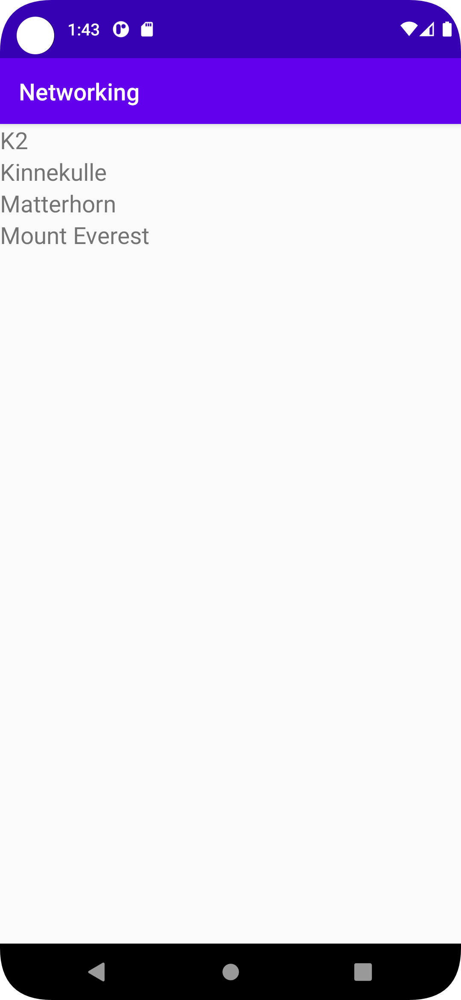

# Rapport Networking
Det första som gjordes var att implementera en recyclerview. Det gjordes igenom att skriva
```
<androidx.recyclerview.widget.RecyclerView xmlns:android="http://schemas.android.com/apk/res/android"
    android:layout_width="match_parent"
    android:layout_height="match_parent"
    android:id="@+id/recycler_view"
    />
```
inuti `activity_main.xml` den fick även ett ID. Det skapades även `list_item.xml` där det är vad
RecyclerViewen visar per objekt.

```
<androidx.constraintlayout.widget.ConstraintLayout xmlns:android="http://schemas.android.com/apk/res/android"
    xmlns:app="http://schemas.android.com/apk/res-auto"
    xmlns:tools="http://schemas.android.com/tools"
    android:layout_width="wrap_content"
    android:layout_height="wrap_content">

    <TextView
        android:id="@+id/Mountain_Name"
        android:layout_width="wrap_content"
        android:layout_height="wrap_content"
        android:textSize="20sp"
        app:layout_constraintEnd_toEndOf="parent"
        app:layout_constraintStart_toStartOf="parent"
        tools:ignore="MissingConstraints" />
</androidx.constraintlayout.widget.ConstraintLayout>
```

Efter detta skapades en list
``` private List<Mountains> listOfMountains; ```
denna lades under klassen MainActivity i `MainActivity.java`. Listen fick även en egen klass
`Mountains.java` där attributen från json datan hanteras. I denna inlämning så behövdes bara namnen
där av hanterar den bara namn.
```
package com.example.networking;

public class Mountains {
    public Mountains(String name) {
        this.name = name;
    }

    public String getName() {
        return name;
    }

    String name;
}

```

Det skapades även en RecyclerViewAdapter.
Adaptern lades till i `MainActivity.java` och fick också en egen klass fil `MountainAdapter.java`

```
public class MountainAdapter extends RecyclerView.Adapter<MountainAdapter.MountainAdapterViewHolder> {
    private List<Mountains> Mountains;

    public MountainAdapter(List<Mountains> Mountains) {
        this.Mountains = Mountains;
    }

    @NonNull
    @Override
    public MountainAdapterViewHolder onCreateViewHolder(@NonNull ViewGroup parent, int viewType) {
        View view = LayoutInflater.from(parent.getContext()).inflate(R.layout.list_item,parent, false);
        return new MountainAdapterViewHolder(view);
    }

    @Override
    public void onBindViewHolder(@NonNull MountainAdapterViewHolder holder, int position) {
        holder.mountain_name.setText(Mountains.get(position).getName());
    }

    @Override
    public int getItemCount() {
        return Mountains.size();
    }

    public class MountainAdapterViewHolder extends RecyclerView.ViewHolder {
        private TextView mountain_name;

        public MountainAdapterViewHolder(@NonNull View itemView) {
            super(itemView);
            mountain_name = itemView.findViewById(R.id.Mountain_Name);
        }
    }
}
```
Detta är koden i `MountainAdapter.java`. Den gjordes med hjälp av en exempel genomgång av brom, med
några justeringar. Bland annat så är det ändrat till att hantera berg som objekt istället för att
hantera strängar. Den innehåller allt som behövs för att RecyclerViewen ska göra sitt arbete.
Efter detta så ändrades det så att JSON_URL istället för JSON_File.
```
 private final String JSON_URL = "https://mobprog.webug.se/json-api?login=brom";
    // private final String JSON_FILE = "mountains.json";
```
Appen fick även tillstånd att använda internet genom att skriva

```
   <uses-permission android:name="android.permission.INTERNET"/>
```

i `AndroidManifest.xml`.

